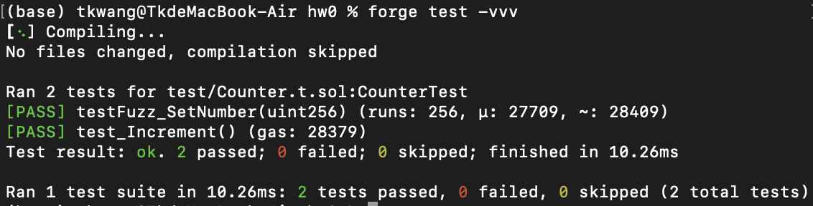
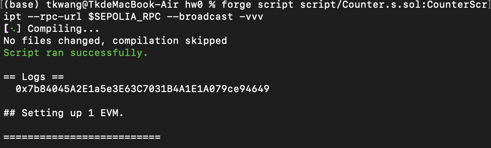
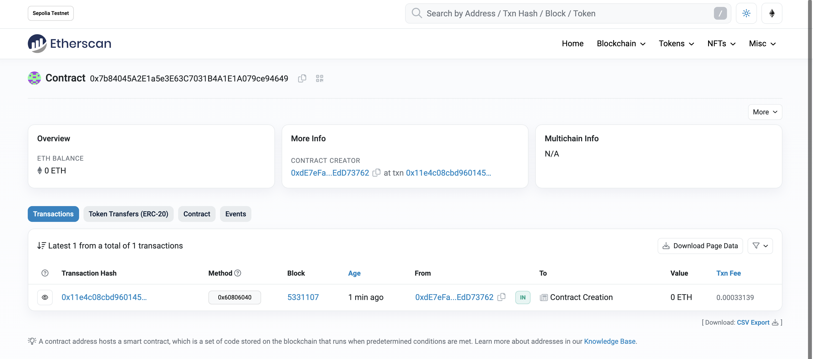

# 2024-Spring-HW0

All the detailed specified in Homework 0 documentation.

## Wallet Address
Please provide your MetaMask wallet address: 0xdE7eFaEE1d5c71858A38a025851898f2EdD73762

## Local Testing
Please provide a screenshot of the `forge test -vvv` command running in your local environment.

## Contract Address
Please provide the contract address that you deployed on the Sepolia network.

0x7b84045A2E1a5e3E63C7031B4A1E1A079ce94649

## Sepolia Etherscan
Paste the contract address into the Sepolia Etherscan and share the screenshot.

